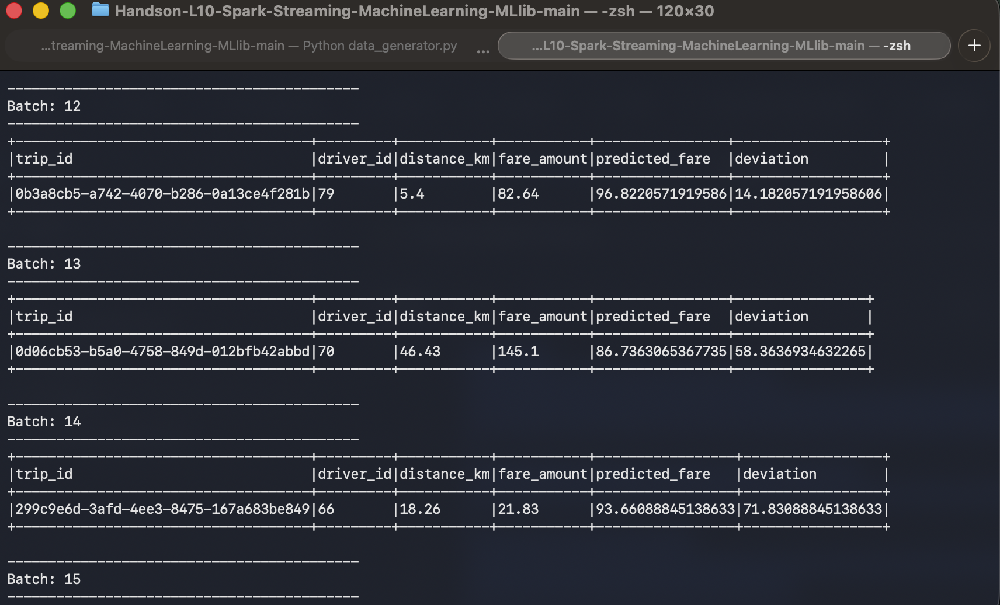
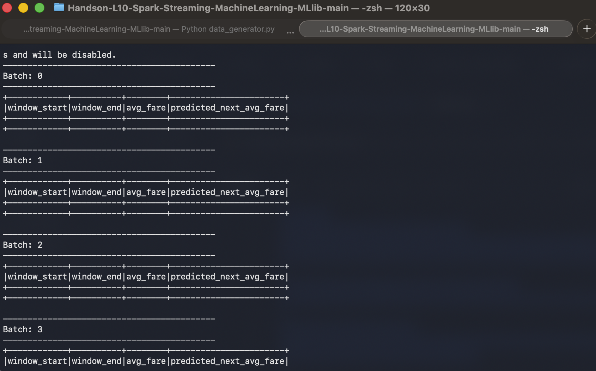

# Handson-L10-Spark-Streaming-MLlib

## Overview
This hands-on demonstrates how to use Spark Structured Streaming and Spark MLlib for real-time fare prediction and fare trend prediction.

The project contains two main tasks:

- **Task 4:** Real-time fare prediction for each incoming trip record
- **Task 5:** Real-time fare trend prediction using window-based feature engineering
- `task4.py` - Predicts fare for each streaming trip using a trained Linear Regression model
- `task5.py` - Predicts average fare trend using time-windowed streaming data
- `data_generator.py` - Generates streaming trip data and sends it to localhost on port 9999
- `training-dataset.csv` - Historical training dataset used to train the models

## Task 4 - Fare Prediction
In Task 4, a Linear Regression model is trained using the historical dataset
### Steps performed
1. Loaded `training-dataset.csv`
2. Cast `distance_km` and `fare_amount` to `DoubleType`
3. Created feature vector using `distance_km`
4. Trained a Linear Regression model
5. Saved the trained model to:
   `models/fare_model`
6. Read live trip data from the socket stream
7. Loaded the saved model
8. Predicted fare for each incoming trip
9. Calculated deviation between actual fare and predicted fare

### Output columns
- `trip_id`
- `driver_id`
- `distance_km`
- `fare_amount`
- `predicted_fare`
- `deviation`

## Task 5 - Fare Trend Prediction
In Task 5, a Linear Regression model is trained using time-based features from historical data.

### Steps performed
1. Loaded `training-dataset.csv`
2. Cast `timestamp` to `TimestampType`
3. Cast `fare_amount` to `DoubleType`
4. Grouped historical data into 5-minute windows
5. Calculated average fare for each window
6. Extracted:
   - `hour_of_day`
   - `minute_of_hour`
7. Created feature vector using time-based features
8. Trained a Linear Regression model
9. Saved the trained model to:
   `models/fare_trend_model_v2`
10. Read streaming data from the socket
11. Applied watermarking on event time
12. Used 5-minute windows sliding every 1 minute
13. Predicted next average fare trend

### Output columns
- `window_start`
- `window_end`
- `avg_fare`
- `predicted_next_avg_fare`

## How to Run

### Step 1: Start the data generator
```bash
python3 data_generator.py

### Step 2: Run Task 4 (Fare Prediction)
```bash

python3 task4.py

### Step 3: Run Task 5 (Fare Trend Prediction)
```bash
python3 task5.py

## Output Screenshots

### Task 4 Output


### Task 5 Output

